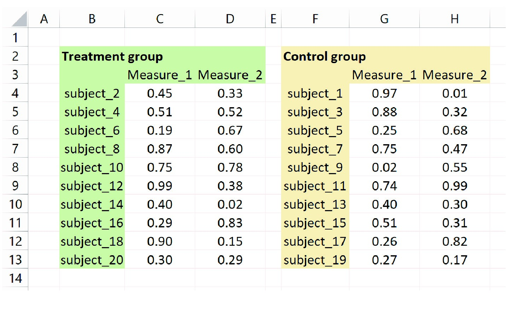
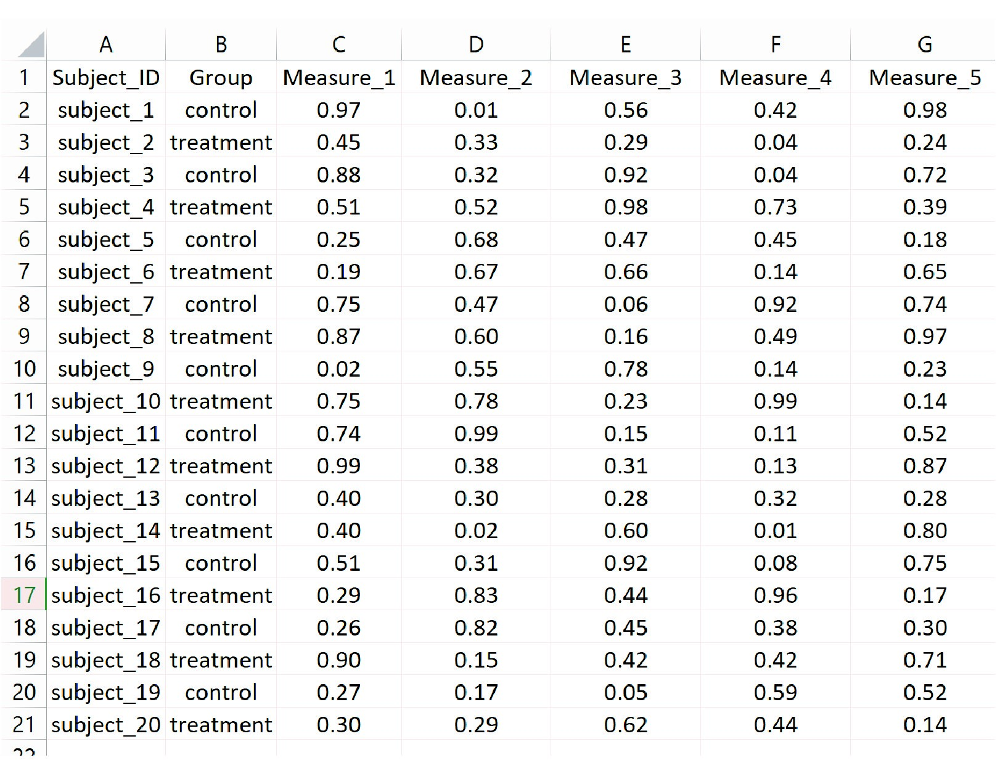

```{r setup, include=FALSE}
knitr::opts_chunk$set(echo = TRUE, message = FALSE, error = FALSE, warning = FALSE)
```

# Data organization

A good data organization is important for an efficient management, analysis, provenance, sharing and reproducibility. Well-organized data will save a lot of work and can prevent common research issues.

Data organization is part of the field of data management and knowledge/record archiving, and spans several disciplines, from computer science to library science. Here we will talk about the specific of organizing data observations into tabular formats (rows and columns) such as spreadsheets. Tabular formats are simple in its conception, but when used properly, they can be powerful tools for data organization.

## Organizing data: archiving vs. analysis, human vs. machine

A common practice in biomedical research is to enter the data into a software in a format that allows for analysis and/or for human understanding. For example, we have all entered data into a spreadsheet as in the image below.


This is great for us to do some quick analysis, for instance, we can quickly calculate the average of each column, or the standard deviation. It is also very easy for us humans to understand what is going on in this datasets. However, this way of organizing data brings several limitations:

* If we want to do something else that the data is not well-formatted for, we will need to rework the dataset for every thing we want to do (e.g., a different analysis, different plots).
* The organization is not understandable by machines. We know what "subject_2" means or we can probably guess right even if we have not created this dataset. But a computer will not understand it (unless we tall them). Also, this organization doesn't seem to follow a standardized format, which means that there is a big chance that next time we enter the data slightly different. 
* The more difficult we make reading datasets by machines, the more we will have to do repetitive manual work. We can use the power of computers to automatize or easy some tasks if we follow a few simple rules.

Now you should be able to see how conceptually, organizing data to be understood only by you, and directed to a specific analysis, is making your life as a researcher more difficult than it needs to be.

A well-structured dataset to organize and manage all your data can give the flexibility to quickly format data for specific analysis, and make it readable by machines, such that we can take advantage of computers, like this one:



## Organizing data in spreadsheets

Most of the content of this section comes from this great paper on the organization of data in spreadsheets:

>Karl W. Broman & Kara H. Woo (2018) Data Organization in Spreadsheets, The American Statistician, 72:1, 2-10, DOI: 10.1080/00031305.2017.1375989

### The Tidy format

The basics are simple: each row is an observation, and each column is a measure, field, or variable. The first row contains the column names, also refered as headers or variable names. The previous image is a dataset organized in the tidy format. A tidy data format is a great way to make data understandable by humans and machines!


### Some recomendations

WORK IN PROGRESS

# Data wrangling in R

Data wrangling refers to the process of reformatting and processing a dataset to a target format for some specific goal. Even though having data in a tidy format helps to reduce a lot of the challenges of working with tabular data, it is often the case we may want to do different transformations to joint different datasets, summarize data, prepare data for analysis and visualization, crease specific subsets of data, or prepare data for other data processing pipelines.

This section will show some of the common data wrangling procedures using R and the tidyverse set of tools.

>Note. I find data wrangling one of the most important skills that one can learn around data. As a data practitioner (such as wet lab biomedical researchers), you will spend a lot of time cleaning and re-working datasets, and this set of technics will help to do it fast, efficiently, and reduce errors.
    
## The Tidyverse

Tidyverse is probably the most used universe of R packages. A package is an R extension (also called library) that adds specific functions to R. A universe contains several packages with integrated and interoperable functionalities. The tidyverse combines packages and functions mostly related to data wrangling, operations and graphics

**Installing a package**
```{r}
# From CRAN
# install.packages("tidyverse")
```

**Loading a package to current R session**
```{r}
library(tidyverse)
```

### dplyr and “piping”

A handy [cheatsheet](https://www.rstudio.com/wp-content/uploads/2015/02/data-wrangling-cheatsheet.pdf) 

Tidyverse contains the dplyr package, a framework for data wrangling. It contains a set of functions that we call verbs and allow us to operate and transform a dataframe object.

“Piping” using the pipe operator (*%>%* for the magrittr package, or *|>* from base R) allow to chain different processes without having to break our code.

````
# Common dplyr syntax with piping

df %>%
  do_this_to_df %>%
  then_do_this_other_thing %>%
  then_do_this_other_thing ...

````
#### Filter, select and mutate

**Filter and select**
```{r}
my_data<-mtcars
head(my_data)

my_data%>%
  filter(disp < 100)

my_data%>%
  filter(disp < 100, gear == 5)

my_data%>%
  select(mpg, disp, wt)

my_data%>%
  filter(disp < 100)%>%
  select(mpg, disp, wt)
```

**Mutate**
```{r}
my_data%>%
  mutate(size = ifelse(wt > 2, "big", "small"))

my_data%>%
  mutate(size = ifelse(wt > 2, "big", "small"),
         cyl_gear = paste(cyl, gear, sep = "_"))
```

### Examples using dplyr and pipes

WORK IN PROGRESS

### Other important dplyr functions

There is a lot to explore in dplyr and the rest of the tidyverse. We will talk about graphics in the data viz class. Other verbs that you probably will need are: *group_by* and *summarize*. Check them out!